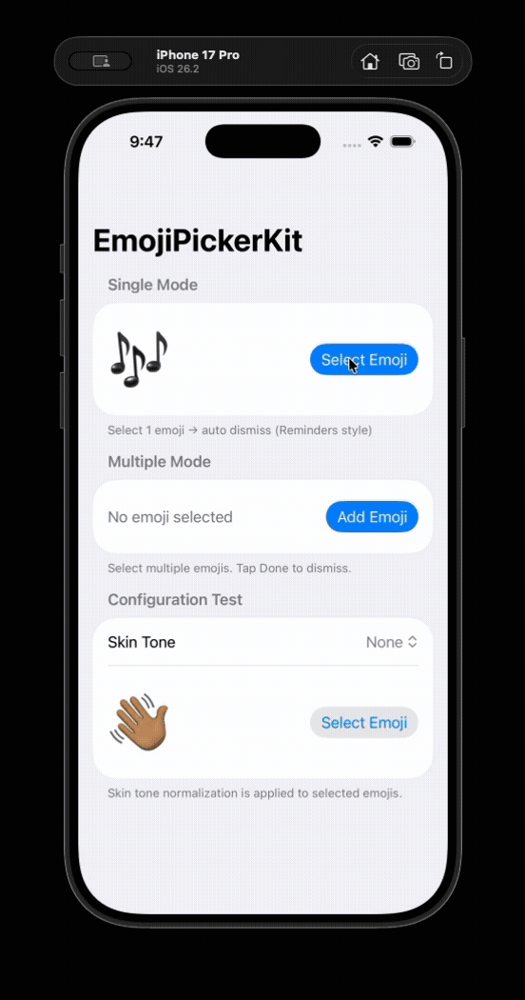

# EmojiPickerKit

[](https://img.shields.io/badge/iOS-16.0%2B-blue)
[](https://img.shields.io/badge/Framework-SwiftUI%20%7C%20UIKit-red)
[](https://img.shields.io/badge/Language-Swift-orange)
[](https://img.shields.io/badge/Dependencies-0-brightgreen)
[](LICENSE)

An **undocumented native system emoji keyboard wrapper** for iOS. No custom UI, no bundled emoji assets — just the real keyboard your users already know.

<div align="center">


</div>

## About

EmojiPickerKit is a zero-dependency Swift package that presents the **native iOS emoji keyboard** as a standalone emoji picker. Unlike third-party libraries that build custom emoji grids, EmojiPickerKit uses the actual system keyboard — giving your users the same search, recents, skin tones, and categories they use every day.

## How It Works

Apple's own Reminders app uses a hidden `UITextField` with an undocumented keyboard type (`UIKeyboardType(rawValue: 124)`) to present an emoji-only keyboard. EmojiPickerKit uses the same approach — an invisible text field becomes first responder, and the native emoji keyboard appears.

On top of this base technique, EmojiPickerKit adds:

- Two selection modes (single auto-dismiss or continuous multiple)
- Emoji-only input filtering
- Skin tone normalization
- Haptic feedback
- Custom accessory views
- Dismiss callback
- SwiftUI view modifier integration
- String extensions for emoji validation

#### Limitations

- iOS 16.0+ required (declared as `platforms: [.iOS(.v16)]` in Package.swift)
- The emoji keyboard type (`rawValue: 124`) is undocumented — it is used by Apple internally but is not part of the public `UIKeyboardType` enum. Like `disableDictation`, this may carry App Store review risk. If Apple changes or removes this raw value in a future iOS version, a standard keyboard will silently appear instead of the emoji keyboard.
- iPadOS: The library is designed for iOS. iPad behavior is untested and may vary with floating keyboard, split view, or external keyboard configurations.

## Important Notes

**`disableDictation` uses a private API.** When `disableDictation` is set to `true`, the library calls `setForceDisableDictation:` on `UITextInputTraits` to hide the dictation button. This is the same approach Apple's Reminders app uses, but it is a **private API** and may cause your app to be **rejected during App Store review**.

The option is `false` by default, so you must explicitly opt in. Use at your own risk in production apps.

## Installation

EmojiPickerKit is available via the [Swift Package Manager](https://www.swift.org/package-manager/).

With your Xcode project open, go to **File > Add Package Dependencies**, enter the address below into the search field, and click **Add Package**.

```
https://github.com/spencer0124/EmojiPickerKit
```

Or add it to your `Package.swift`:

```swift
dependencies: [
    .package(url: "https://github.com/spencer0124/EmojiPickerKit.git", from: "0.2.0")
]
```

Then import the module where you want to use it:

```swift
import EmojiPickerKit
```

## Usage

### SwiftUI

Use the `.emojiKeyboard()` view modifier to present the emoji keyboard. Pass a binding to control visibility and a closure to receive the selected emoji.

```swift
import EmojiPickerKit

struct ContentView: View {
    @State private var showPicker = false
    @State private var emoji = "😊"

    var body: some View {
        VStack {
            Text(emoji).font(.system(size: 64))
            Button("Pick Emoji") { showPicker = true }
        }
        .emojiKeyboard(
            isPresented: $showPicker,
            onDismiss: { print("Keyboard dismissed") }
        ) { selected in
            emoji = selected
        }
    }
}
```

### UIKit

Create an `EmojiKeyboardTextField`, add it to your view, and call `present()` to show the keyboard.

```swift
import EmojiPickerKit

let textField = EmojiKeyboardTextField(mode: .single)
view.addSubview(textField)

textField.onEmojiSelected = { emoji in
    print("Selected: \(emoji)")
}

textField.onDismiss = {
    print("Keyboard dismissed")
}

textField.present()
```

## Configuration

### EmojiKeyboardMode

```swift
enum EmojiKeyboardMode {
    case single
    case multiple(accessoryView: ((_ dismiss: @escaping () -> Void) -> AnyView)? = nil)
}
```

- **`.single`** — Dismisses after one emoji is selected (Reminders-style).
- **`.multiple()`** — Stays open for continuous selection. Shows a default "Done" toolbar, or pass a custom accessory view.

**Custom accessory view (SwiftUI — `@ViewBuilder` overload, no `AnyView` needed):**

```swift
.emojiKeyboard(
    isPresented: $showPicker,
    accessoryView: { dismiss in
        Button("Close") { dismiss() }
    }
) { emoji in
    emojis.append(emoji)
}
```

**Custom accessory view (UIKit):**

```swift
let tf = EmojiKeyboardTextField(
    mode: .multiple(accessoryView: { dismiss in
        AnyView(Button("Close") { dismiss() })
    })
)
```

### EmojiKeyboardConfiguration

Pass an `EmojiKeyboardConfiguration` to customize behavior.

```swift
let config = EmojiKeyboardConfiguration(
    emojiOnly: true,
    normalizeSkinTone: .strip,
    hapticFeedback: .light,
    disableDictation: false
)
```

| Option              | Default  | Description                                                                                       |
| ------------------- | -------- | ------------------------------------------------------------------------------------------------- |
| `emojiOnly`         | `true`   | Rejects non-emoji input.                                                                          |
| `normalizeSkinTone` | `nil`    | Normalize skin tone modifiers (see below).                                                        |
| `hapticFeedback`    | `.light` | Haptic style on selection, or `nil` to disable.                                                   |
| `disableDictation`  | `false`  | Hide the dictation button. **Uses private API — see [Important Notes](#important-notes).** |

### EmojiSkinToneNormalization

Controls how skin tone modifiers are handled on selected emoji.

```swift
enum EmojiSkinToneNormalization {
    case strip        // Remove skin tone → 👋🏽 becomes 👋
    case light        // 🏻
    case mediumLight  // 🏼
    case medium       // 🏽
    case mediumDark   // 🏾
    case dark         // 🏿
}
```

```swift
let config = EmojiKeyboardConfiguration(normalizeSkinTone: .strip)
// User selects 👋🏽 → callback receives 👋
```

### String Extensions

EmojiPickerKit includes handy `String` extensions for working with emoji:

```swift
"😊".isSingleEmoji          // true
"👨‍👩‍👧‍👦".isSingleEmoji         // true (ZWJ sequence = one glyph)
"hi".isSingleEmoji          // false
"😊😊".isSingleEmoji        // false

"hello 😊".containsOnlyEmoji   // false
"😊🔥".containsOnlyEmoji       // true

"👋🏽".normalizingSkinTone(to: .strip)  // "👋"
"👋🏽".normalizingSkinTone(to: .dark)   // "👋🏿"

// Emoji extraction
"Hello 😊 World 🔥".emojis           // ["😊", "🔥"]
"no emoji here".emojis               // []

// Emoji count
"😊🔥".emojiCount                    // 2
"👨‍👩‍👧‍👦".emojiCount                // 1 (ZWJ = one glyph)

// Remove emoji
"Hello 😊 World".removingEmojis      // "Hello  World"
"Hello 😊 World".strippingEmojis     // "Hello World"

// Skin tone detection
"👋🏽".emojiSkinTone                  // .medium
"👋".emojiSkinTone                    // nil

// ZWJ decomposition
"👨‍👩‍👧‍👦".emojiComponents             // ["👨", "👩", "👧", "👦"]
"😊".emojiComponents                 // ["😊"]
```

## Example Project

Explore the [Example project](Example/) for a demo of single mode, multiple mode, and skin tone normalization in action.

## Contributing

Contributions are welcome! Here's how to get started:

1. **Fork** the repository and clone your fork.
2. Create a feature branch: `git checkout -b feature/my-change`
3. Make your changes and add tests.
4. Run the test suite:
   ```bash
   xcodebuild test \
     -workspace . \
     -scheme EmojiPickerKit \
     -destination "platform=iOS Simulator,name=iPhone 16 Pro"
   ```
5. Open a pull request with a clear description.

#### Project Structure

```
Sources/EmojiPickerKit/
├── EmojiKeyboardTextField.swift      # Core UITextField subclass
├── EmojiKeyboardModifier.swift       # SwiftUI wrapper + view modifier
├── EmojiKeyboardConfiguration.swift  # Configuration struct
└── Extensions/
    ├── String+Emoji.swift            # containsOnlyEmoji, isSingleEmoji, emojis, emojiCount, removingEmojis, strippingEmojis, emojiComponents
    └── String+SkinTone.swift         # Skin tone normalization, emojiSkinTone

Example/                              # Demo app (Xcode project)
Tests/EmojiPickerKitTests/            # Test suite
```

#### Guidelines

- Keep PRs focused — one feature or fix per PR.
- Follow existing code style and naming conventions.
- Add tests for new public API surface.
- This project uses no external dependencies — please keep it that way.

## License

EmojiPickerKit is released under the MIT License. See [LICENSE](LICENSE) for details.
